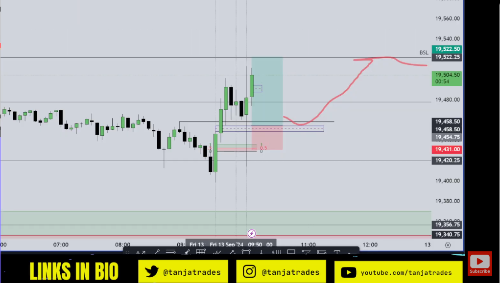

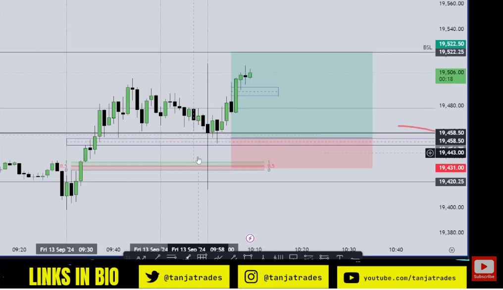

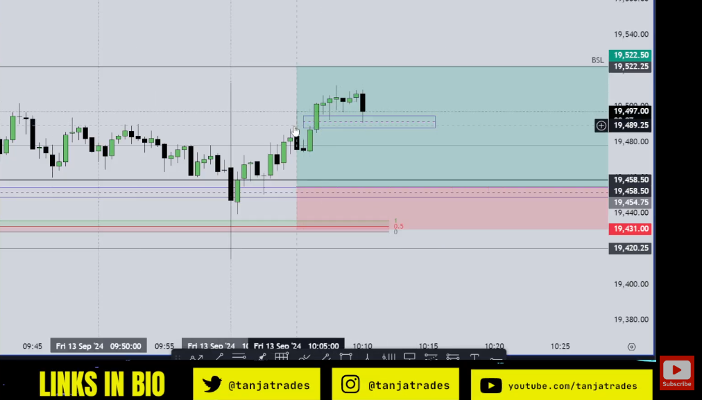

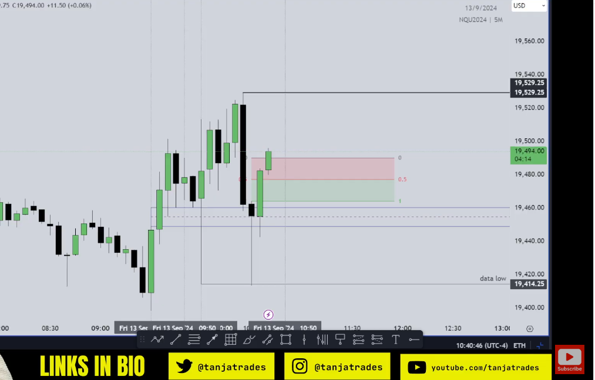

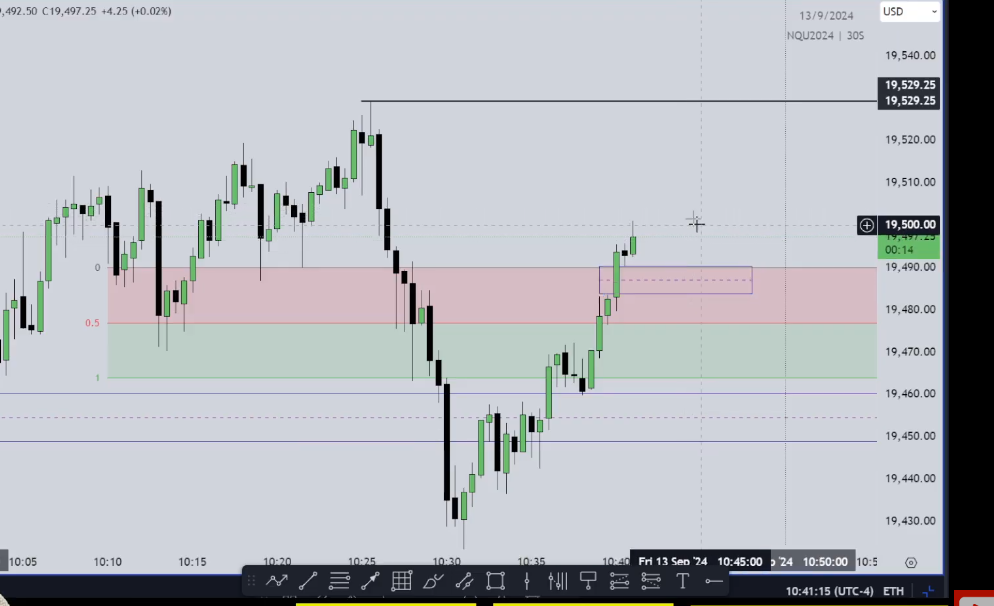

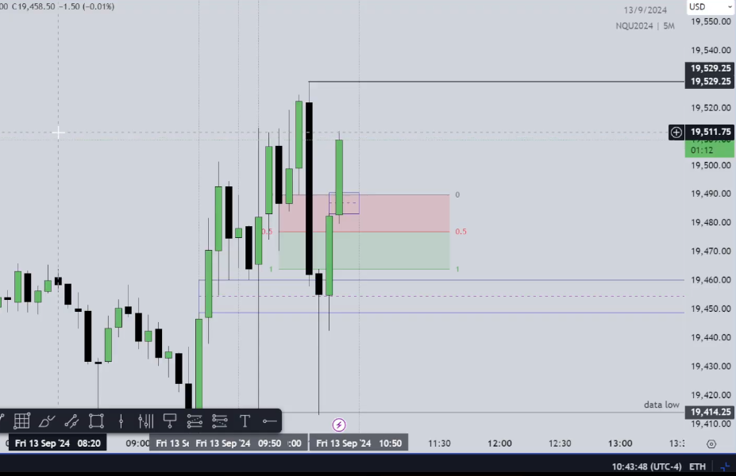

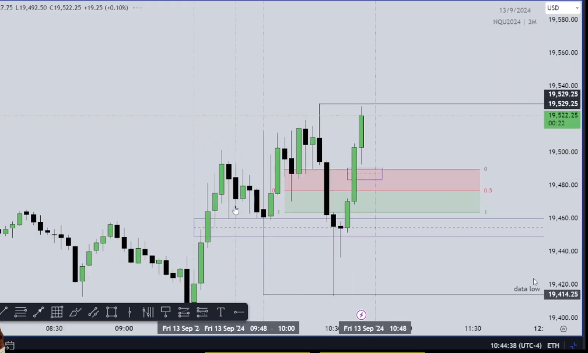

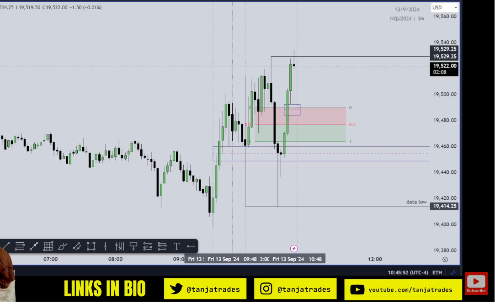

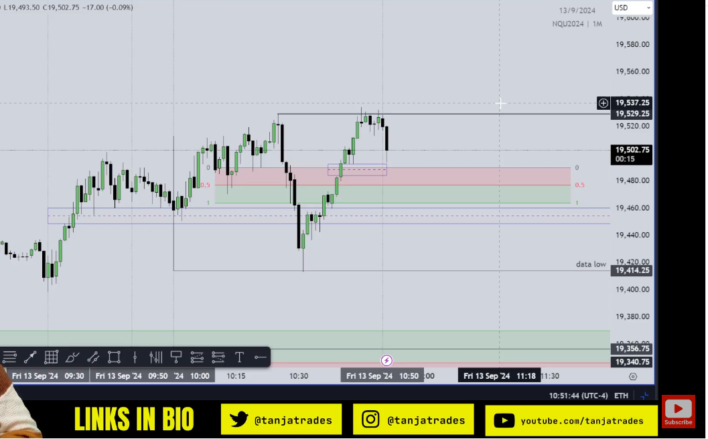

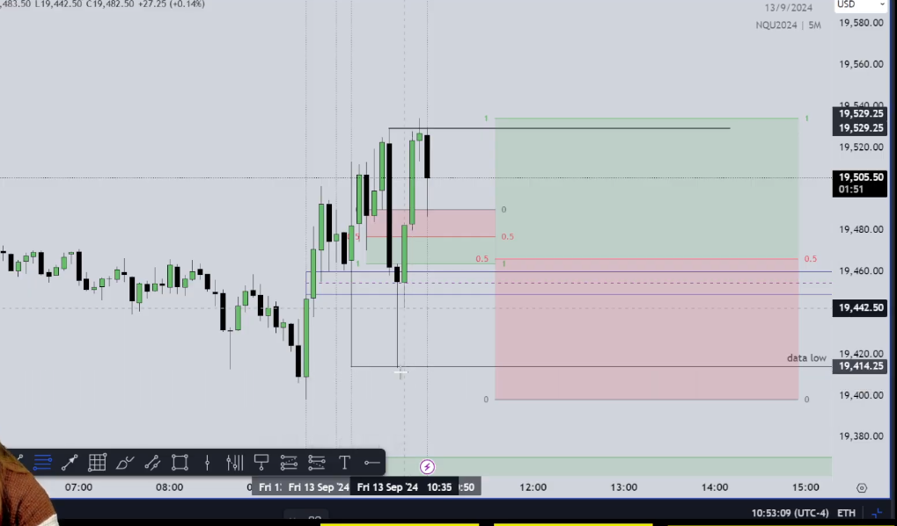

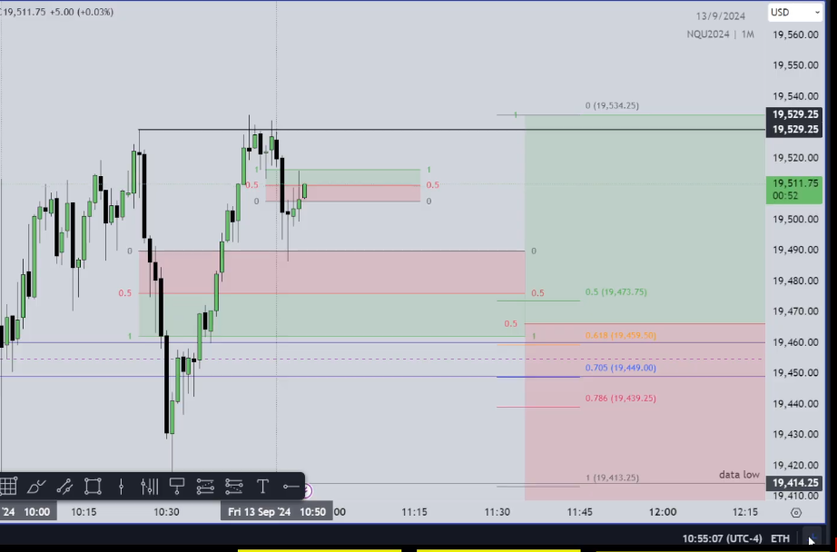

From https://x.com/infinitytradeIO/status/1666837026673393667

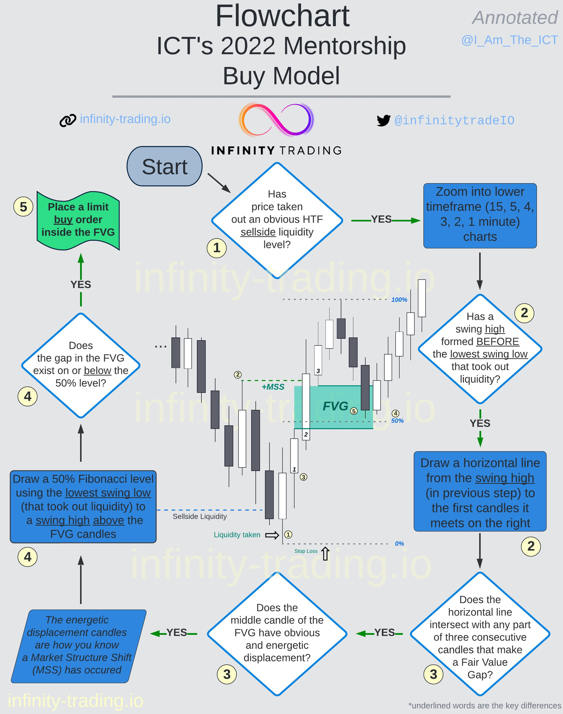

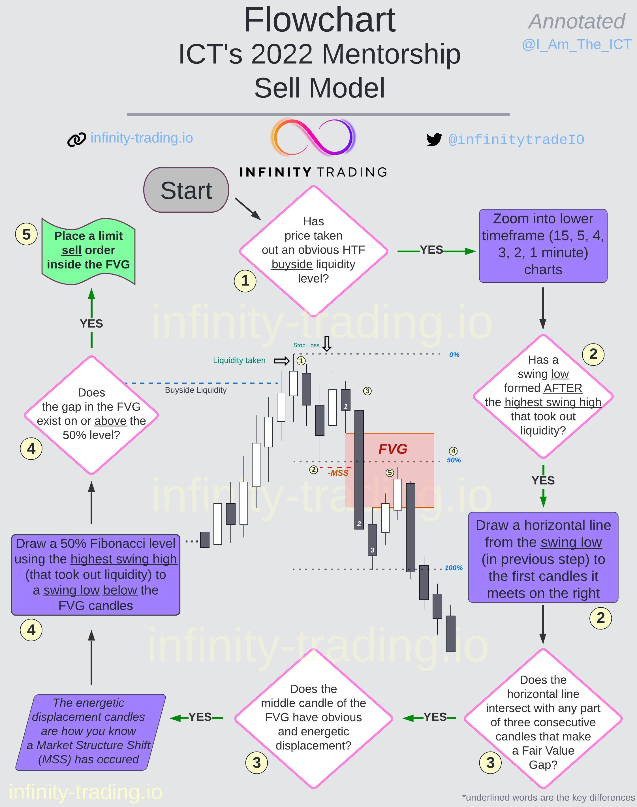

HugoFX

https://www.youtube.com/watch?v=2gBbFnZnwk8

"Session London connue pour créer le plus haut et le plus bas de la journée."
